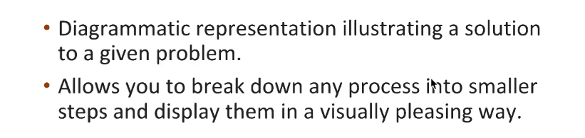

# Python with DSA

## Flow Chart

__Q1 How to Approach Problems__

What you will do when you first say any problem 

1. Analyze the Problem
2. Think of the solution
3. Pen Down the Solution
4. Code the Solution

```
Pen Down the Solution is very important step and most programmer alaways skip that step but this step is very powerful here you will get to know how eraticate most of the errors.
```
So pen down the solution is very important there are ways through which we can do it here we will discuss about flow chart that came in the picture.

__Q2 What exactly the flow chart is ?__



Flow Charts Other Benefits :

* Debugging : You can rectify few mistakes by running small test cases so make sure you perform 2-3 test cases.
* It is language independent.
* Break down the process into smaller steps which reduce the difficulty in undersatnding complicated structure.
* Amazing Documentation

__Flowchart Components__


```
Let's learn how actually we have to work with flow charts

Example 1: Add two Numbers ?

Step 1: Take Input becz without numbers what we can add.

(So after know two numbers what we will do is we will store two numbers in our mind and in case of computer we store in any kind of memory)

Step 2 : After getting two numbers we will have to store inside computer memory and specify any name through which we can use or call that stored value in it.

Step 3: After storing two numbers let's suppose A = 10 & B = 15 what we will have to do is perform operations. (i.e addition,subtraction whatever it is)

Step 4: After adding two numbers we have to store output value inside sum variable. (i.e sum = 25)

Step 5: After that I have to print that sum that's it.
```

flow chart for the above question


__Decision Making Algorithms__

For Decision making Algorithm we used rombus


```
Example : If a number is divisible by 2 then it is even or else odd 

Step 1: Take two number as input.
Step 2: Store Two Numbers in a variable.
Step 3: After that we have to check that given number from the input is completely divisible by 2 or not.
Step 4: If it is not divisible by 2 then print "Odd" else "Even".
```
Flow chart for the above question


```
Example:Find Largest of 3 N umbers

Step 1: Take input three numbers as a input and store 
Step 2: 
```